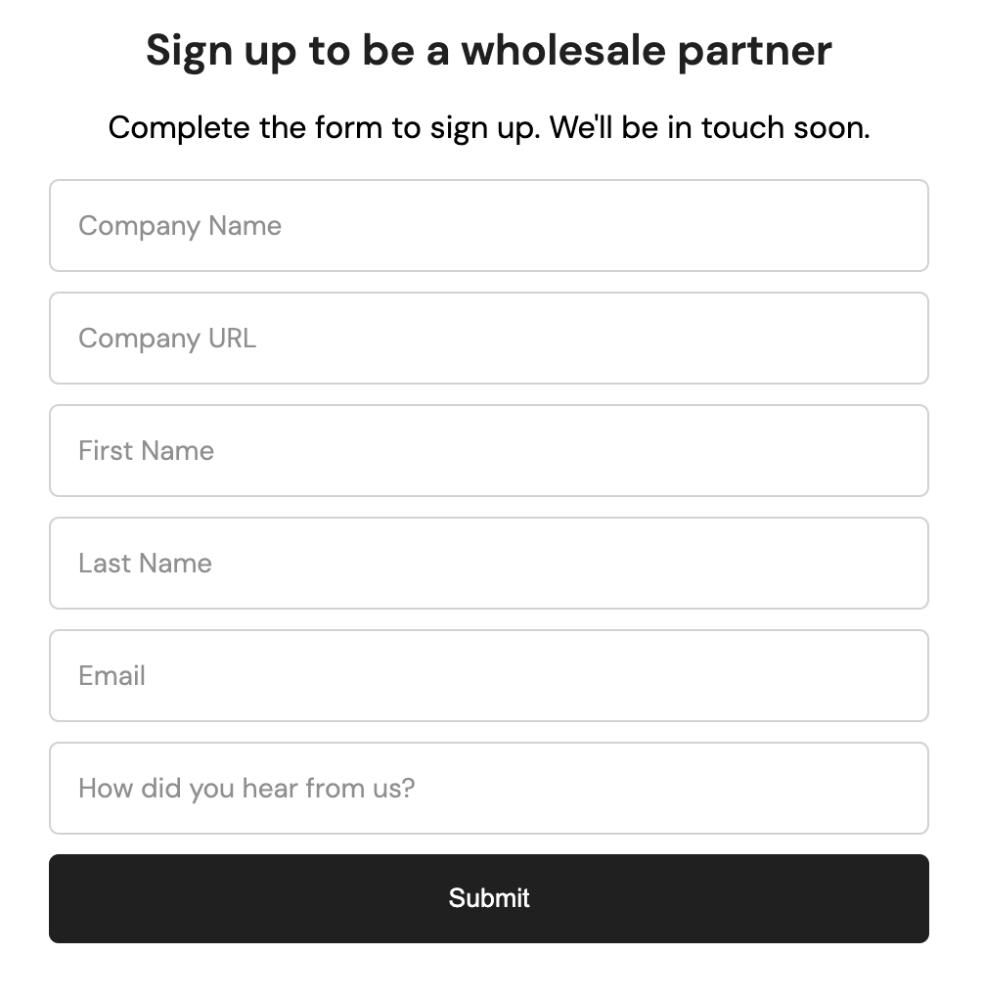

# HTML & CSS Mini Projects

Welcome to my HTML & CSS mini projects!  
Here, I will features a small, focused project built from scratch with only HTML, CSS and a little bit of javascript.

This is a personal challenge to improve layout skills, practice styling techniques, and build a consistent frontend habit.

## 🚀 Live Site

👉 [Visit the live projects](https://vannymagalong.github.io/html-css-mini-projects/)

## Projects list

| Project Name              | Output                                                         |
| ------------------------- | -------------------------------------------------------------- |
| 01 Omnifood               |                             |
| 02 Basic Form             |                                 |